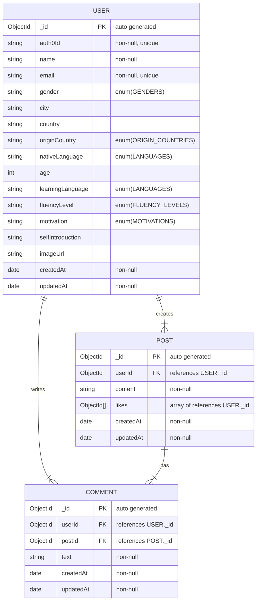

# DB Schema Spec

```mermaid
erDiagram
    USER {
        ObjectId _id PK "auto generated"
        string auth0Id "non-null, unique"
        string name "non-null"
        string email "non-null, unique"
        string gender "enum(GENDERS)"
        string city
        string country
        string originCountry "enum(ORIGIN_COUNTRIES)"
        string nativeLanguage "enum(LANGUAGES)"
        int age
        string learningLanguage "enum(LANGUAGES)"
        string fluencyLevel "enum(FLUENCY_LEVELS)"
        string motivation "enum(MOTIVATIONS)"
        string selfIntroduction
        string imageUrl
        date createdAt "non-null"
        date updatedAt "non-null"
    }

    POST {
        ObjectId _id PK "auto generated"
        ObjectId userId FK "references USER._id"
        string content "non-null"
        ObjectId[] likes "array of references USER._id"
        date createdAt "non-null"
        date updatedAt "non-null"
    }

    COMMENT {
        ObjectId _id PK "auto generated"
        ObjectId userId FK "references USER._id"
        ObjectId postId FK "references POST._id"
        string text "non-null"
        date createdAt "non-null"
        date updatedAt "non-null"
    }

    USER ||--|{ POST : "creates"
    USER ||--|{ COMMENT : "writes"
    POST ||--|{ COMMENT : "has"
```
